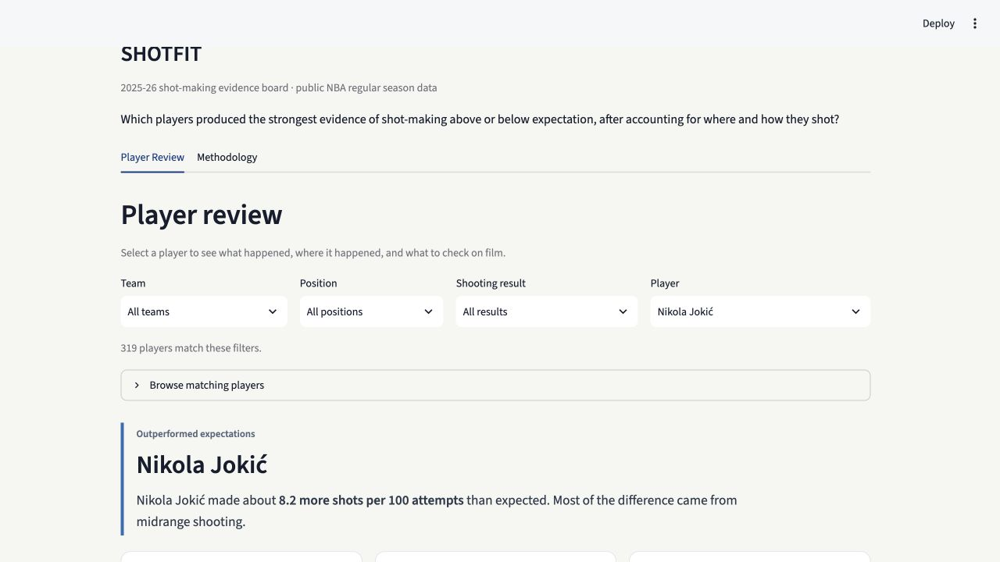
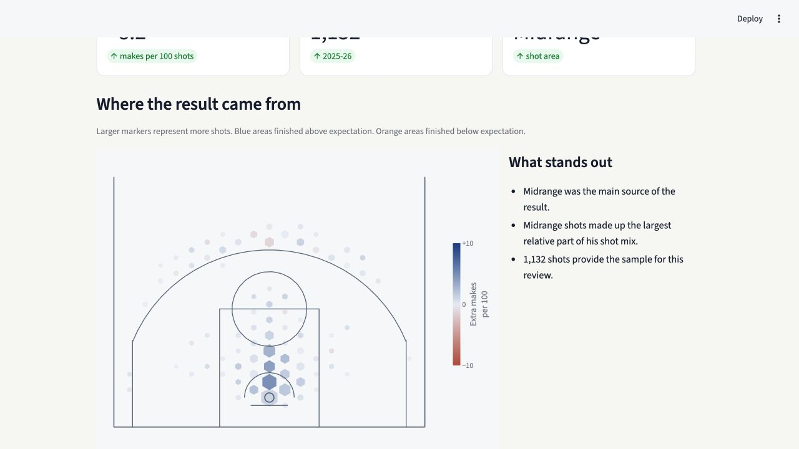

# ShotFit

**A player shooting review tool for basketball staff.**

ShotFit identifies NBA players whose shooting results differed from what their shot locations and situations would normally produce. It shows where the difference occurred and gives the reviewer a short list of questions to take to film.



[Model card](MODEL_CARD.md) | [Data dictionary](docs/data_dictionary.md) | [Architecture](docs/architecture.md)

## Why I built it

Basic shooting percentages tell us what happened. They do not tell us whether a player benefited from an easier shot mix or made difficult shots at an unusual rate.

I built ShotFit as a first step in that review. It compares each field-goal attempt with similar shots from around the league, adds those probabilities into an expected make total, and highlights players whose actual results deserve a closer look.

The goal is not to replace scouting. The goal is to make the next film session more focused.

## The basketball question

> Which players shot better or worse than expected in 2025-26, where did the difference occur, and what should a reviewer check on film?

ShotFit is a screening tool. It does not rank overall player quality, forecast next season, or make a personnel recommendation.

## How a reviewer uses it

1. Filter by team, position, or shooting result.
2. Select a player and see where his makes differed from expectation.
3. Use the film questions to investigate shot quality, contests, balance, and repeatability.

The app has two pages:

- **Player Review** presents the basketball-facing result, court chart, shot mix, and film questions.
- **Methodology** shows the model comparison, calibration, validation standards, and limitations.

## Example: AJ Green

AJ Green made about 3.6 more shots per 100 attempts than expected across 618 attempts in 2025-26. Most of the difference came from above-the-break threes.

That is not a claim that the result will continue. It is a reason to review the types of attempts, defender proximity, balance, and shot preparation behind it.



## How it works

```text
NBA public shot data
        |
        v
Shot-context model
        |
        v
Expected make probability for every shot
        |
        v
Sample-size adjustment at the player and court-area level
        |
        v
Player review, court chart, and film questions
```

The shot-context model estimates the probability that an average NBA player would make each shot. Player and team identity are excluded, so the comparison is based on the shot itself rather than the shooter's reputation.

Actual makes are compared with expected makes. The player and area results are then adjusted for sample size so that smaller samples move closer to the league average.

## Model design

The seasons are kept in chronological order:

| Stage | Season | Purpose |
|---|---|---|
| Training | 2023-24 | Fit the shot-context model |
| Validation | 2024-25 | Compare models and set review standards |
| Final review | 2025-26 | Produce the public player results |

The pipeline compares a zone baseline, logistic regression, and XGBoost. Logistic regression was selected because XGBoost did not clear the preset improvement requirement on both validation log loss and Brier score. The simpler model was retained.

Final 2025-26 performance:

| Metric | Result |
|---|---:|
| Log loss | 0.6441 |
| Brier score | 0.2270 |
| ROC AUC | 0.652 |
| Calibration error | 0.0029 |

The model uses shot distance, coordinates, angle, shot value, court area, action type, period, time remaining, late-period context, and home or road status.

It does not use player identity, team identity, future statistics, or post-shot events.

## Review standards

Players need at least 250 attempts in the final season. That cutoff was selected with 2024-25 validation data before the 2025-26 player labels were produced.

The app translates the statistical labels into three review groups:

- **Worth reviewing:** the adjusted result remained above expectation after accounting for sample size.
- **No clear signal:** the result could not be separated from normal shooting variation.
- **Potential concern:** the adjusted result remained below expectation after accounting for sample size.

The full interval rules and sensitivity checks are documented in the [model card](MODEL_CARD.md).

## What the data cannot tell us

Public shot records do not include:

- Defender distance
- Pass quality
- Detailed movement and balance
- Screen quality and play design
- Health, fatigue, or internal role information

ShotFit describes what happened relative to the public context available for each shot. Film, tracking data, coaching context, and scouting judgment are still required.

## Run the app locally

The repository includes a prebuilt app bundle, so the interface can run without downloading data or retraining the model.

On macOS:

```bash
./run_local.command
```

Or run it directly:

```bash
uv sync --all-groups
uv run streamlit run streamlit_app.py
```

## Rebuild the analysis

```bash
uv run python -m shotfit.cli ingest
uv run python -m shotfit.cli build-features
uv run python -m shotfit.cli train
uv run python -m shotfit.cli export-app
```

Run the complete pipeline with:

```bash
uv run python -m shotfit.cli all
```

The public app reads only precomputed Parquet and JSON files. It does not call NBA.com or retrain at runtime.

## Repository structure

```text
shotfit/
|-- streamlit_app.py       # Streamlit application
|-- src/shotfit/           # Ingestion, features, modeling, evaluation, and charts
|-- data/app/              # Precomputed application bundle
|-- tests/                 # Unit, contract, and artifact tests
|-- MODEL_CARD.md          # Model design, validation, and intended use
`-- docs/                  # Architecture and data dictionary
```

The project uses Python 3.11, `uv`, DuckDB, pandas, scikit-learn, XGBoost, Streamlit, Plotly, Altair, pytest, and Ruff.
