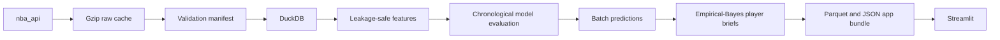

# Architecture

```mermaid
flowchart LR
  A[nba_api] --> B[Gzip raw cache]
  B --> C[Validation manifest]
  C --> D[DuckDB]
  D --> E[Leakage-safe features]
  E --> F[Chronological model evaluation]
  F --> G[Batch predictions]
  G --> H[Empirical-Bayes player briefs]
  H --> I[Parquet and JSON app bundle]
  I --> J[Streamlit]
```

The deployed application reads only the app bundle. It never calls NBA.com or retrains a model at runtime.

